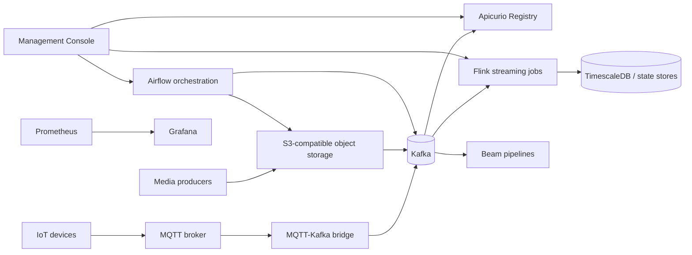

# DEALIoT

DEALIoT is a production-oriented real-time IoT data platform for multimodal telemetry, media metadata, schema governance, stream processing, orchestration, and operational compliance evidence.

The platform targets livestock, precision agriculture, and industrial IoT deployments where device telemetry, GPS data, media objects, and governance evidence must be processed reliably from edge ingestion to curated datasets.

[](https://github.com/Smartappli/DEALIoT/actions/workflows/ci.yml)
[](https://github.com/Smartappli/DEALIoT/actions/workflows/production-deployment-test.yml)
[](https://github.com/Smartappli/DEALIoT/actions/workflows/codeql.yml)
[](https://github.com/Smartappli/DEALIoT/actions/workflows/shellcheck.yml)
[](https://github.com/Smartappli/DEALIoT/actions/workflows/sonarqube.yml)
[](https://sonarcloud.io/summary/new_code?id=Smartappli_DEALIoT)
[](https://sonarcloud.io/summary/new_code?id=Smartappli_DEALIoT)
[](https://sonarcloud.io/summary/new_code?id=Smartappli_DEALIoT)

## Platform Scope

DEALIoT provides six runtime planes:

| Plane | Responsibility | Primary components |
|---|---|---|
| Ingestion | Secure MQTT ingestion and routing to Kafka topics | VerneMQ, MQTT-Kafka bridge |
| Event backbone | Durable event transport and schema governance | Kafka KRaft, Apicurio Registry |
| Object storage | Raw and derived media object storage | SeaweedFS S3 locally, managed S3 in production |
| Processing | Stream processing, feature projection, replay, and backfill | Flink, Beam, Airflow |
| Storage | Operational SQL state and connection pooling | TimescaleDB, Patroni, HAProxy, PgBouncer |
| Operations | Observability, control surfaces, and compliance evidence | Prometheus, Grafana, Management Console |

## Architecture



### Production Architecture Principles

- Kubernetes is the primary production target.
- Docker Swarm remains available for simpler runtime deployments and smoke validation.
- Stateful dependencies are externalized in production unless managed by a dedicated operator.
- Runtime dependency traffic is encrypted or private: Kafka `SASL_SSL`, MQTT TLS, S3 TLS, PostgreSQL private connectivity, and Redis private connectivity.
- Kubernetes production uses default-deny NetworkPolicies, Pod Security `restricted`, immutable image tags, readiness/liveness probes, HPA, PDB, and topology spread constraints.
- Secrets are expected from a secret manager, External Secrets Operator, or equivalent out-of-band mechanism.

## Repository Layout

```text
.github/workflows/                         CI, security scans, image build, deployment validation
airflow/dags/                              Airflow DAGs
apicurio/bootstrap/                        Registry schema bootstrap payloads
dealiot_contracts/                         Shared event contract helpers
deploy/kubernetes/base/                    Kubernetes base runtime manifests
deploy/kubernetes/overlays/production/     Production Kustomize overlay
deploy/swarm/                              Docker Swarm runtime and smoke stacks
docs/                                      Architecture, compliance, and runbooks
flink/jobs/                                PyFlink streaming jobs
management-console/                        Internal operational console
mqtt-kafka-bridge/                         MQTT to Kafka ingestion bridge
pipelines/                                 Replay and backfill utilities
scripts/                                   Bootstrap and smoke-test scripts
tests/                                     Unit, integration, and deployment guardrail tests
wildfi-decoder/                            Offline WildFi binary decoder image wrapper
```

## Event Topics

Core runtime topics include:

| Topic | Purpose |
|---|---|
| `raw.sensor` | Device telemetry and decoded WildFi sensor payloads |
| `raw.gps` | GPS and GNSS events |
| `raw.image2d.meta` | 2D image metadata |
| `raw.image3d.meta` | 3D image metadata |
| `raw.video2d.meta` | 2D video metadata |
| `raw.video3d.meta` | 3D video metadata |
| `media.object.events` | Object storage notifications |
| `features.events` | Derived feature events |
| `state.latest` | Compacted latest state projection |
| `dlq.events` | Invalid or unroutable event records |

Governance, Data Act, DGA, security, resilience, and compliance evidence topics are defined in `docker-compose.yml`, `apicurio/bootstrap/`, and `docs/runbooks/security-resilience-compliance.md`.

## Local Development

### Prerequisites

- Docker Engine with Compose v2
- Python 3.12 or newer for local tests
- `uv` for reproducible Python tooling
- `kubectl` for rendering Kubernetes overlays

### Configure Local Secrets

```bash
cp .env.example .env
mkdir -p secrets
```

Populate the secret files listed in `README` runbooks and `.env.example`. Local secrets must stay outside Git; `.gitignore` and `.dockerignore` exclude `.env` and `secrets/`.

### Start The Development Stack

```bash
docker compose -f docker-compose.yml -f docker-compose.dev.yml up -d --build
```

Useful local endpoints when the development overlay is active:

| Service | Endpoint |
|---|---|
| Airflow | `http://localhost:8088` |
| Flink | `http://localhost:8081` |
| Apicurio Registry | `http://localhost:8082/apis/registry/v3` |
| Management Console | `http://localhost:8090` |
| Grafana | `http://localhost:3000` |
| Prometheus | `http://localhost:9090` |
| SeaweedFS S3 | `http://localhost:8333` |

### Run The End-To-End Smoke Test

```bash
bash scripts/smoke-e2e.sh
```

The smoke test starts the core event-flow services, submits the minimal Flink job, publishes MQTT fixtures, validates Kafka topics, verifies Apicurio artifacts, and captures diagnostics on failure.

## Production Deployment

### Kubernetes

The production overlay is located at `deploy/kubernetes/overlays/production`.

Before deployment:

1. Replace all `sha-REPLACE_WITH_RELEASE_SHA` image tags with immutable release SHA tags.
2. Replace example dependency endpoints in `runtime-config.production.example.env`.
3. Provide `dealiot-secrets` through a secret manager or External Secrets Operator.
4. Narrow NetworkPolicy `ipBlock` ranges to real private dependency CIDRs.
5. Confirm metrics-server or another HPA metrics provider is installed.

Render locally:

```bash
kubectl kustomize deploy/kubernetes/overlays/production >/tmp/dealiot-production.yaml
```

Apply through your GitOps controller or deployment pipeline after replacing all placeholders.

### Docker Swarm

The Swarm stack is located at `deploy/swarm/dealiot-stack.yml` and expects external Kafka, MQTT, S3, PostgreSQL, and Redis services.

```bash
docker stack config -c deploy/swarm/dealiot-stack.yml
docker stack deploy -c deploy/swarm/dealiot-stack.yml dealiot
```

Create required Swarm secrets before deployment. See `deploy/swarm/README.md` for the exact contract.

## Runtime Security

The production runtime contract requires:

- Kafka `SASL_SSL` with SCRAM credentials.
- MQTT TLS on port `8883` by default.
- Management Console bearer-token protection for `/api/*` and mutation routes.
- Kubernetes Pod Security `restricted` on production and CI smoke namespaces.
- Default-deny Kubernetes NetworkPolicies.
- Immutable image tags and CI checks that reject mutable tags and unresolved placeholders.
- Container resources, readiness/liveness probes, dropped Linux capabilities, and disabled service-account token automounting.

## Testing And Quality Gates

Run the same validation layers used by CI:

```bash
uv run python -m unittest discover -s tests/unit -p "test_*.py" -v
uv run python -m unittest -v tests/integration/test_platform_integration.py
uv run --with PyYAML python -m unittest -v tests/deployment/test_deployment_readiness.py
uv run python -m unittest -v tests/test_application_smoke.py
```

Additional CI gates include:

- Pre-commit hooks: YAML, JSON, Ruff, Mypy, djLint.
- CodeQL, Bandit, OSSAR, OSV Scanner, SonarQube, and Codacy coverage upload.
- Docker image builds with SBOM and provenance attestations.
- Kubernetes render and server-side dry-run validation.
- Docker Swarm render and smoke deployment validation.
- kind smoke deployment for the bridge image.

## Operations And Runbooks

Primary runbooks:

- [Operations](docs/runbooks/operations.md)
- [Backup and restore](docs/runbooks/backup-restore.md)
- [Security hardening](docs/runbooks/security-hardening.md)
- [Security resilience compliance](docs/runbooks/security-resilience-compliance.md)
- [WildFi ingestion](docs/runbooks/wildfi-ingestion.md)
- [Data Governance Act](docs/runbooks/data-governance-act.md)
- [Data Act](docs/runbooks/data-act.md)
- [Dataset catalogue and DMP](docs/runbooks/data-management-plan.md)
- [Zenodo export](docs/runbooks/zenodo-export.md)
- [OpenAIRE export](docs/runbooks/openaire-export.md)

The GitHub Wiki contains the production architecture handbook, deployment guide, configuration reference, operational runbooks, scaling model, and security checklist.

## WildFi Support

DEALIoT supports WildFi telemetry through:

- MQTT subscription to `$share/ingestors/wildfi/#`.
- Routing decoded GPS/GNSS payloads to `raw.gps`.
- Routing decoded IMU, environment, proximity, movement, and metadata payloads to `raw.sensor`.
- Offline binary decoding through the packaged `wildfi-decoder` image.

References:

- `docs/runbooks/wildfi-ingestion.md`
- `deploy/kubernetes/overlays/production/wildfi-decoder-config.yaml`
- `deploy/kubernetes/overlays/production/wildfi-decoder-job.yaml`

## Contribution Workflow

1. Create changes with tests.
2. Run the validation commands above.
3. Render Kubernetes and Swarm manifests when deployment files change.
4. Keep production placeholders out of rendered manifests.
5. Commit with a focused message and push to GitHub.

## License

This repository is licensed under the terms in [LICENSE](LICENSE).
