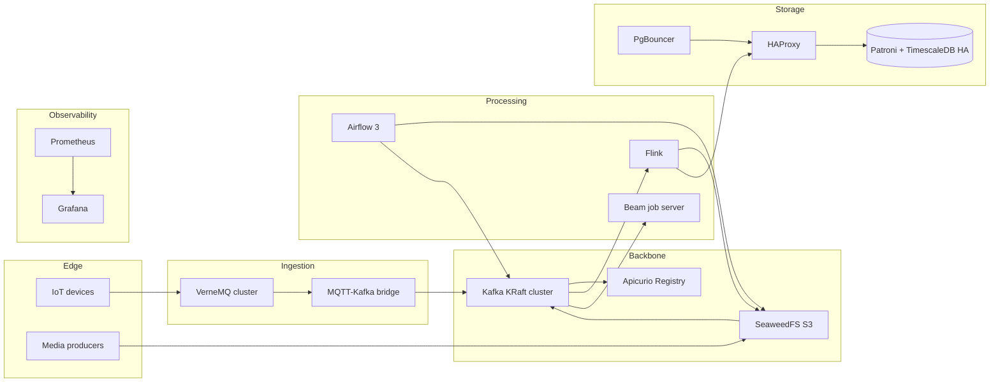

# Real-Time Multimodal IoT Data Platform

This repository implements a reproducible edge-to-cloud architecture for multimodal IoT ingestion, schema governance, stream/batch processing, high-availability transactional storage, and operational observability. The stack targets real-time livestock and precision-agriculture workloads, but the design is generic enough for other industrial IoT domains.

[](https://github.com/Smartappli/DEALIoT/actions/workflows/ci.yml)
[](https://github.com/Smartappli/DEALIoT/actions/workflows/codeql.yml)
[](https://github.com/Smartappli/DEALIoT/actions/workflows/dependabot/dependabot-updates)
[](https://github.com/Smartappli/DEALIoT/actions/workflows/renovate.yml)
[](https://github.com/Smartappli/DEALIoT/actions/workflows/shellcheck.yml)
[](https://github.com/Smartappli/DEALIoT/actions/workflows/sonarqube.yml)
[](https://sonarcloud.io/summary/new_code?id=Smartappli_DEALIoT)


## 1. What the platform does

The platform combines six logical planes:

1. **Edge and ingestion**
   - MQTT ingestion through a 3-node VerneMQ cluster.
   - An MQTT-to-Kafka bridge that forwards telemetry, GPS messages, and media metadata into Kafka topics.

2. **Event backbone and schema governance**
   - A 3-node Apache Kafka KRaft cluster.
   - Apicurio Registry for JSON schema governance and artifact lifecycle.

3. **Object storage**
   - SeaweedFS S3 as object storage for raw and derived media objects.
   - Bucket notifications that emit `media.object.events` to Kafka.

4. **Stream and batch processing**
   - Apache Flink for stateful stream processing with checkpointing and savepoints on SeaweedFS S3.
   - Apache Beam job server and Python harness for portable pipelines.
   - Apache Airflow 3 for scheduled orchestration and replay/backfill workflows.

5. **Operational and analytical storage**
   - A 3-node Patroni/etcd-backed TimescaleDB HA cluster.
   - HAProxy for read-write and read-only routing.
   - PgBouncer for client pooling.

6. **Observability and administration**
   - Prometheus, Grafana, cAdvisor, statsd-exporter, postgres-exporter.
   - pgAdmin for database inspection.

## 2. High-level architecture



## 3. Repository layout

```text
airflow/                  Airflow DAGs, logs, plugins
apicurio/bootstrap/       Registry bootstrap artifacts
beam/                     Beam job server and Python harness images
flink/                    Custom PyFlink image and jobs
grafana/                  Dashboards and provisioning
haproxy/                  Read-write / read-only routing
kafka-connect/            Debezium connector definitions
mqtt-kafka-bridge/        MQTT to Kafka bridge
orchestration/            Airflow image build
patroni/                  Patroni templates
pgadmin/                  pgAdmin preconfigured servers
pgbouncer/                Explicit pooling configuration
pipelines/                Replay/backfill utilities
prometheus/               Metrics scraping and alert rules
scripts/                  Bootstrap and entrypoint helpers
secrets/                  Docker secrets (local dev only)
```

## 4. Critical design decisions finalized in this version

### Fixed inconsistencies

This finalized version addresses the following problems found during the audit:

- The Airflow DAG passed `--window-start` and `--window-end`, but `pipelines/media_backfill.py` only accepted `--since-minutes`.
- The Airflow containers did not receive Kafka and S3/SeaweedFS credentials, so the backfill workflow could not read objects or publish replayed events.
- Kafka Connect internal topics (`__connect-configs`, `__connect-offsets`, `__connect-status`) were missing while Kafka auto-topic creation was disabled.
- The `raw.gps` topic existed but no matching schema artifact was bootstrapped into Apicurio Registry.
- The MQTT bridge emitted a generic record that did not match the intended telemetry contract.
- PgBouncer shipped dedicated config files and userlists that were not mounted, which made the repository harder to reason about.
- The environment-specific compose overlays were empty.

### Final behavior of the backfill pipeline

The Airflow DAG now calls a backfill script that:

1. Reads objects from SeaweedFS S3 in a bounded window.
2. Maps the bucket and media kind to one of:
   - `raw.image2d.meta`
   - `raw.image3d.meta`
   - `raw.video2d.meta`
   - `raw.video3d.meta`
3. Publishes synthetic metadata events to Kafka so downstream consumers can reprocess missed media arrivals.

This makes the Airflow workflow operational instead of only printing objects to stdout.

## 5. Topics and contracts

### Kafka topics created during bootstrap

| Topic | Purpose | Partitions | Replication |
|---|---|---:|---:|
| `raw.gps` | GPS events | 24 | 3 |
| `raw.sensor` | Telemetry events | 24 | 3 |
| `raw.image2d.meta` | 2D image metadata | 12 | 3 |
| `raw.image3d.meta` | 3D image metadata | 12 | 3 |
| `raw.video2d.meta` | 2D video metadata | 12 | 3 |
| `raw.video3d.meta` | 3D video metadata | 12 | 3 |
| `media.object.events` | S3 object notifications | 12 | 3 |
| `features.events` | Derived features | 24 | 3 |
| `alerts.events` | Alerts | 12 | 3 |
| `state.latest` | Compacted latest state | 12 | 3 |
| `dlq.events` | Dead-letter events | 12 | 3 |
| `kafkasql-journal-v3` | Apicurio KafkaSQL journal | 1 | 3 |
| `kafkasql-snapshots-v3` | Apicurio KafkaSQL snapshots | 1 | 3 |
| `registry-events-v3` | Apicurio registry events | 1 | 3 |
| `__connect-configs` | Kafka Connect internal config topic | 1 | 3 |
| `__connect-offsets` | Kafka Connect internal offsets topic | 12 | 3 |
| `__connect-status` | Kafka Connect internal status topic | 6 | 3 |

### Registry artifacts bootstrapped

- `raw.sensor`
- `raw.gps`
- `raw.image2d.meta`
- `raw.image3d.meta`
- `raw.video2d.meta`
- `raw.video3d.meta`
- `media.object.events`

## 6. Network zones

- `ingest_net`: internal ingestion plane for MQTT and SeaweedFS producers.
- `kafka_net`: internal event backbone.
- `patroni_backend`: internal HA database control plane.
- `patroni_frontend`: client-facing database access plane.
- `orchestration_net`: Airflow, Grafana, Apicurio UI, and other control-plane services.

This segmentation limits accidental coupling between components and makes troubleshooting easier.

## SonarQube setup

This repository is configured for GitHub Actions-based SonarQube analysis:

- Workflow: `.github/workflows/sonarqube.yml`
- Project scanner config: `sonar-project.properties`
- Required repository secrets:
  - `SONAR_TOKEN`
  - `SONAR_HOST_URL` (optional; defaults to `https://sonarcloud.io` when unset, set it for self-hosted SonarQube)
  - `CODACY_PROJECT_TOKEN` (optional; when set, coverage is also uploaded to Codacy)

The workflow runs on pushes to `main`/`master`, on pull requests, and manually via `workflow_dispatch`.

## 7. Configuration model

The stack uses **two complementary configuration channels**:

1. **`.env` / `.env.example`**
   - Non-file environment variables.
   - Public URLs.
   - Build pins.
   - SeaweedFS S3 credentials used by Flink/Airflow/Beam.

2. **`./secrets/*.txt`**
   - Database passwords.
   - SeaweedFS S3 credentials.
   - PgAdmin password.
   - PgBouncer userlists.

### Minimum `.env` variables

```bash
cp .env.example .env
```

Then set at least:

- `AIRFLOW_FERNET_KEY`
- `AIRFLOW_API_SECRET_KEY`
- `AIRFLOW_JWT_SECRET`
- `AIRFLOW_ADMIN_USER`
- `AIRFLOW_ADMIN_PASSWORD`
- `VERNEMQ_DISTRIBUTED_COOKIE`
- `VERNEMQ_ADMIN_PASSWORD`
- `SEAWEEDFS_S3_ACCESS_KEY`
- `SEAWEEDFS_S3_SECRET_KEY`
- `APICURIO_PUBLIC_URL`
- `GRAFANA_PUBLIC_URL`

### Docker secret files required

```text
secrets/app_user_password.txt
secrets/debezium_password.txt
secrets/seaweedfs_s3_secret_key.txt
secrets/seaweedfs_s3_access_key.txt
secrets/patroni_repl_password.txt
secrets/patroni_rewind_password.txt
secrets/pgadmin_default_password.txt
secrets/pgbouncer_ro_userlist.txt
secrets/pgbouncer_rw_userlist.txt
secrets/postgres_exporter_password.txt
secrets/postgres_superuser_password.txt
```

### Generate new secrets locally

```bash
python - <<'PY'
import secrets
from pathlib import Path

target = Path("secrets")
target.mkdir(exist_ok=True)

files = {
    "app_user_password.txt": secrets.token_urlsafe(24),
    "debezium_password.txt": secrets.token_urlsafe(24),
    "seaweedfs_s3_access_key.txt": "change-me",
    "seaweedfs_s3_secret_key.txt": secrets.token_urlsafe(32),
    "patroni_repl_password.txt": secrets.token_urlsafe(24),
    "patroni_rewind_password.txt": secrets.token_urlsafe(24),
    "pgadmin_default_password.txt": secrets.token_urlsafe(24),
    "postgres_exporter_password.txt": secrets.token_urlsafe(24),
    "postgres_superuser_password.txt": secrets.token_urlsafe(24),
}

for name, value in files.items():
    (target / name).write_text(value + "\n", encoding="utf-8")
PY
```

## 8. Startup sequence

Use the base compose file plus an environment-specific overlay.

### Development

```bash
docker compose -f docker-compose.yml -f docker-compose.dev.yml up -d --build
```

### Staging

```bash
docker compose -f docker-compose.yml -f docker-compose.staging.yml up -d --build
```

### Production-like local validation

```bash
docker compose -f docker-compose.yml -f docker-compose.prod.yml up -d --build
```

## 9. Service endpoints

| Service | URL / Port |
|---|---|
| Airflow API/UI | `http://localhost:8088` |
| Flink UI | `http://localhost:8081` |
| Kafka Connect | `http://localhost:8083` |
| Apicurio Registry API | `http://localhost:8082/apis/registry/v3` |
| Apicurio Registry UI | `http://localhost:8888` |
| SeaweedFS S3 API | `http://localhost:8333` |
| SeaweedFS Filer UI | `http://localhost:8889` |
| pgAdmin | `http://localhost:5050` |
| Grafana | `http://localhost:3000` |
| Prometheus | `http://localhost:9090` |
| HAProxy stats | `http://localhost:7000` |
| PostgreSQL RW | `localhost:5432` |
| PostgreSQL RO | `localhost:5433` |
| PgBouncer RW | `localhost:6432` |
| PgBouncer RO | `localhost:6433` |

## 10. Validation checklist

After startup, validate in this order:

### Kafka
```bash
docker compose exec kafka1 /opt/kafka/bin/kafka-topics.sh   --bootstrap-server kafka1:9092 --list
```

### Patroni / PostgreSQL
```bash
docker compose exec pg1 curl -s http://127.0.0.1:8008/patroni
docker compose exec haproxy sh -lc "nc -zv 127.0.0.1 5432"
```

### SeaweedFS buckets
```bash
docker compose exec seaweedfs-init sh -lc 'echo "SeaweedFS bootstrap completed"'
```

### Apicurio artifacts
Open the registry UI and verify the expected groups/artifacts are present.

### Airflow DAG import
Open the Airflow UI and verify that `media_backfill` is visible and import-error free.

## 11. Operational notes

### Airflow 3
The stack uses the Airflow 3 split model:
- API/UI server (`airflow-apiserver`)
- scheduler
- worker
- triggerer
- standalone DAG processor

This separation is intentional and aligns with the Airflow 3 deployment model.

### Flink state management
Flink stores checkpoints and savepoints in SeaweedFS S3:
- `s3://flink-checkpoints/streaming`
- `s3://flink-savepoints/streaming`

### Debezium / Kafka Connect
The `timescaledb-source` connector captures changes from `appdb` via a named publication:
- publication: `dbz_publication`
- slot: `debezium_appdb`

### Database routing
- RW traffic: HAProxy `5432`
- RO traffic: HAProxy `5433`
- pooled RW: PgBouncer `6432`
- pooled RO: PgBouncer `6433`

## 12. Recommended next steps

1. Add one or more concrete Flink jobs under `flink/jobs/`.
2. Add downstream consumers for `features.events`, `alerts.events`, and `state.latest`.
3. Add reverse proxy/TLS for non-local deployments.
4. Add CI validation with:
   - YAML validation
   - Python linting
   - Docker build checks
   - smoke tests for bootstrap topics and schemas
5. Add retention, compaction, and backup policies per environment.

## 13. Included artifacts in this finalized package

This finalized package contains:

- a patched `docker-compose.yml`
- functional environment overlays for dev/staging/prod
- a new `README.md`
- a new `.env.example`
- a corrected MQTT bridge
- a corrected media backfill utility
- a new `raw.gps` Apicurio schema
