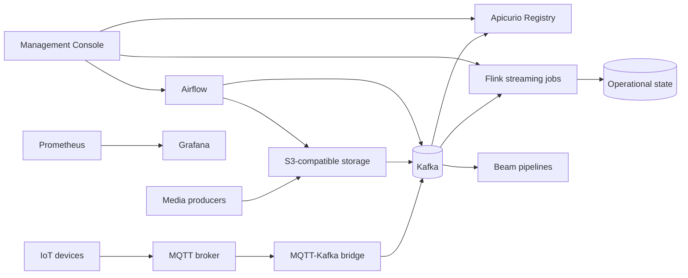

# Architecture

DEALIoT is structured as an event-driven IoT platform. Devices and media producers publish to edge interfaces. The platform normalizes events, governs schemas, processes streams and batches, and exposes operational evidence for governance and compliance.

## Logical Flow

## Ingestion

The MQTT-Kafka bridge subscribes through shared MQTT subscriptions so replicas can scale horizontally without duplicate processing. Production MQTT defaults to TLS on port `8883`.

Default topic filters:

- `$share/ingestors/devices/#`
- `$share/ingestors/wildfi/#`

The bridge validates core event contracts and routes invalid payloads to `dlq.events`.

## Kafka And Schemas

Kafka is the durable event backbone. Production clients use `SASL_SSL` by default with SCRAM credentials. Apicurio Registry stores JSON schema artifacts for raw telemetry, media metadata, governance evidence, security evidence, resilience evidence, and legal/compliance evidence.

Core topics:

| Topic | Purpose |
|---|---|
| `raw.sensor` | Generic telemetry and decoded WildFi sensor payloads |
| `raw.gps` | GPS and GNSS events |
| `raw.image2d.meta` | 2D image metadata |
| `raw.image3d.meta` | 3D image metadata |
| `raw.video2d.meta` | 2D video metadata |
| `raw.video3d.meta` | 3D video metadata |
| `media.object.events` | Object storage notifications |
| `features.events` | Derived features |
| `state.latest` | Compacted latest state |
| `dlq.events` | Dead-letter records |

## Processing

Flink owns continuous stateful processing. Checkpoints and savepoints are stored in S3-compatible storage:

- `s3://flink-checkpoints/streaming`
- `s3://flink-savepoints/streaming`

Airflow owns scheduled orchestration, replay, export, and bounded backfill workflows. Beam images are available for portable pipelines.

## Production Runtime Model

Production Kubernetes uses:

- Replicas and HPA for horizontally scalable components.
- PDBs to protect availability during voluntary disruption.
- Topology spread constraints to avoid replica concentration on one node.
- Readiness/liveness probes for runtime services.
- Pod Security `restricted` namespace labels.
- Default-deny NetworkPolicies.

## Deliberate External Dependencies

The production overlay intentionally excludes stateful dependencies. Use managed services or operators for:

- Kafka or Strimzi.
- PostgreSQL or CloudNativePG/Crunchy.
- Redis or managed Redis.
- MQTT or an operator/Helm-managed broker.
- S3-compatible object storage.

This keeps application rollout independent from stateful lifecycle management.
